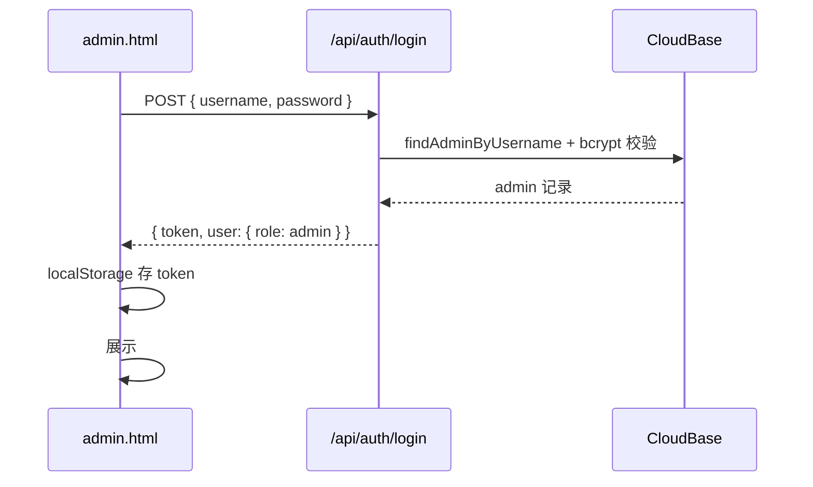
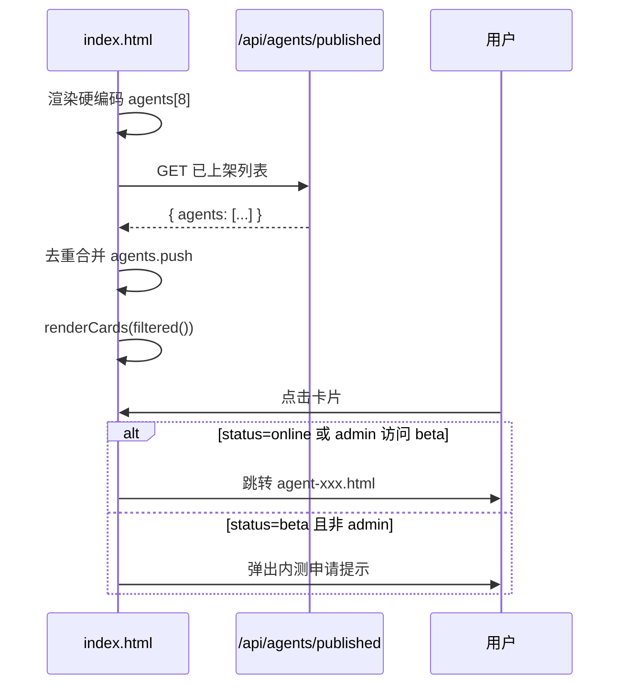

# GoalinWeb 管理员体系与智能体上架模块设计总结

> 本文档总结 `/www/wwwroot/goalinweb` 项目中**管理员账号 / 管理后台**与**智能体上架（卡片 + 交互页）**的实现形式与业务流程，供后续在小程序项目中做相似模块设计与开发时参考。

---

## 1. 整体架构

```
┌─────────────────────────────────────────────────────────────────┐
│                        前端（静态 HTML）                          │
│  index.html（智能体中心）  admin.html（管理后台）  agent-*.html   │
│  assets/auth.js（登录态）  assets/app-base.js（路径挂载）         │
└───────────────┬───────────────────────────────┬───────────────────┘
                │                               │
                ▼                               ▼
┌───────────────────────────┐     ┌─────────────────────────────────┐
│  Nginx 静态 + 反向代理      │     │  Node dev-server (PM2 :8765)    │
│  /agent-hub/              │────▶│  lib/auth-routes.cjs            │
│  /agent-hub/api/*         │     │  lib/agent-routes.cjs           │
└───────────────────────────┘     │  lib/agent-publish.cjs          │
                                  └───────────┬─────────────────────┘
                                              │
                    ┌─────────────────────────┼─────────────────────────┐
                    ▼                         ▼                         ▼
            CloudBase（用户/管理员）    MySQL（usage_logs）      HiAgent API
            data/agents-registry.json   文件系统 agent-*.html
            lib/builtin-agents.cjs
```

**技术栈要点：**

| 层级 | 技术 |
|------|------|
| 前端 | 纯 HTML + 内联 CSS/JS，无框架 |
| 后端 | Node.js 原生 `http`，CommonJS 模块 |
| 认证 | JWT（`jsonwebtoken`）+ Bearer Token |
| 用户数据 | 腾讯云 CloudBase |
| 用量统计 | MySQL `usage_logs` |
| AI 对话 | HiAgent 平台 API（经本站代理） |
| 进程管理 | PM2 `goalinweb` |
| 生产挂载 | `https://goalinlegal.com/agent-hub/` |

---

## 2. 管理员账号体系设计

### 2.1 双轨制账号模型

项目存在**两套身份体系**，权限语义不同：

| 类型 | 登录方式 | 存储 | JWT `provider` | `role` | 用途 |
|------|----------|------|----------------|--------|------|
| **后台管理员** | 用户名 + 密码 | CloudBase `admin_accounts` | `local_admin` | `admin` | 登录 `admin.html`，调用 `/api/admin/*` |
| **前台用户** | 手机号 + 短信验证码 | CloudBase 用户集合 | `cloudbase` | `user` | 登录 `login.html`，使用智能体对话 |
| **前台管理员（内测）** | 手机号 + 短信验证码 | 同上，手机号在白名单 | `cloudbase` | `admin` | 可进入 `status=beta` 的内测智能体 |

**关键设计决策：**

- 管理后台**只认** `provider === 'local_admin'` 的 JWT（见 `requireUser`）。
- 手机号登录即使 `role=admin`，也**不能**访问 `/api/admin/*`，只能在前台作为内测管理员使用 beta 智能体。
- 内测权限判断：`GoalinAuth.isBetaAdmin(user)` → `user.role === 'admin'`。

### 2.2 管理员账号初始化

启动时 `auth.ensureAdminAccounts()` 自动执行：

1. **迁移**（一次性）：MySQL 旧表 `admin_phones` → CloudBase。
2. **创建 root 账号**：环境变量 `ADMIN_USERNAME` / `ADMIN_PASSWORD`（默认 `root` / `123456@mima`），bcrypt 哈希后写入 CloudBase。
3. **同步内测手机号白名单**：`ADMIN_PHONES`（逗号分隔）写入 CloudBase，供手机号登录时判定 `isAdmin`。

相关环境变量（`.env.example`）：

```env
JWT_SECRET=...
JWT_EXPIRES_IN=7d
ADMIN_USERNAME=root
ADMIN_PASSWORD=change_me_on_first_deploy
ADMIN_PHONES=15880266926,15080459806
```

### 2.3 JWT 结构

**后台管理员 Token：**

```json
{
  "sub": "<admin_cloudbase_id>",
  "username": "root",
  "role": "admin",
  "provider": "local_admin"
}
```

**手机号用户 Token：**

```json
{
  "sub": "<user_cloudbase_id>",
  "phone": "13800138000",
  "nickName": "",
  "role": "user | admin",
  "provider": "cloudbase",
  "totalQuota": 10,
  "usedQuota": 0
}
```

前端 Token 存储：`localStorage.goalin_auth_token`，请求头 `Authorization: Bearer <token>`。

### 2.4 权限校验流程（后端）

```
请求 /api/admin/*
    │
    ▼
requireAdmin(req)
    │
    ▼
requireUser(req)
    ├─ 解析 Bearer Token
    ├─ provider === 'cloudbase' → 拒绝（返回 null）
    ├─ provider === 'local_admin' → 查 CloudBase admin 账号
    └─ status === 'active' → 通过
```

---

## 3. 管理后台设计与流程

### 3.1 页面结构（`admin.html`）

单页应用，两大视图：

| 视图 | 内容 |
|------|------|
| `#loginView` | 管理员用户名/密码登录 |
| `#app` | 统计卡片 + 智能体上架面板 + 用户列表 |

### 3.2 管理后台功能模块

```
管理后台
├── 统计概览（GET /api/admin/stats）
│   ├── 注册用户数（CloudBase）
│   ├── 活跃用户数
│   ├── 累计对话数（MySQL usage_logs）
│   └── 今日对话数
├── 智能体上架（见第 4 节）
└── 用户管理（GET/PATCH /api/admin/users）
    └── 启用/禁用手机号用户
```

### 3.3 登录流程



**前端关键逻辑：**

```javascript
// 登录
const user = await GoalinAuth.login(username, password);
if (user.role !== 'admin') { logout(); throw ... }

// 管理 API 统一封装
function adminApi(path, opts) {
  return fetch(`${origin}${base}/api/admin${path}`, {
    headers: GoalinAuth.authHeaders(),
    ...opts
  });
}
```

### 3.4 会话恢复

页面加载时 `requireAdmin()` → `GoalinAuth.fetchMe()` → 若 `role === 'admin'` 则直接进入后台，否则显示登录框。

> **注意：** `/api/auth/me` 对 CloudBase 手机号 admin 也会返回 `role=admin`，但 `requireAdmin` 后端会拒绝其调用管理接口。后台必须走用户名密码登录。

---

## 4. 智能体上架模块设计与流程

### 4.1 模块职责划分

| 文件 | 职责 |
|------|------|
| `lib/agent-publish.cjs` | 核心业务：校验、生成 HTML、读写注册表、删除、重建 |
| `lib/agent-routes.cjs` | HTTP 路由分发 |
| `lib/builtin-agents.cjs` | 内置 8 个智能体元数据（与 index.html 硬编码一致） |
| `lib/hiagent-constants.cjs` | HiAgent API 地址与上架页运行时脚本注入 |
| `data/agents-registry.json` | 后台上架智能体持久化注册表 |
| `admin.html` | 上架表单 + 列表 + 删除 |
| `index.html` | 首页卡片：内置 + 动态加载已上架 |

### 4.2 智能体数据来源（双源合并）

```
首页展示 agents[]
    │
    ├── 内置智能体（index.html 硬编码数组，8 个）
    │       └── 来源标记 source: 'builtin'
    │
    └── 后台上架智能体（data/agents-registry.json）
            └── 启动时 fetch GET /api/agents/published 合并进 agents[]
            └── 来源标记 source: 'published'
```

管理后台列表（`GET /api/admin/agents`）合并展示**内置 + 后台上架**，便于统一查看；仅 `source=published` 可删除。

### 4.3 智能体元数据模型

**首页卡片字段（内置 & 上架共用）：**

```typescript
interface AgentCard {
  id: number;
  name: string;           // 名称
  icon: string;           // Emoji 图标
  tag: string;            // 分类：民商事/合规/助手/...
  status: 'online' | 'beta';
  subtitle: string;       // 副标题
  url: string;            // 页面路径或外链
  desc: string;           // 简介
  features: string[];     // 卡片特性列表（最多 5 条）
  supportsFileUpload?: boolean;
  source?: 'builtin' | 'published';
  publishedAt?: string;   // ISO 时间，内置显示「内置」
  slug?: string;          // 后台上架唯一标识
  external?: boolean;     // 是否外链（如制度审查）
}
```

**注册表额外字段（仅后台上架，存于 registry，公开 API 不返回 apiKey）：**

```typescript
interface PublishedAgentMeta extends AgentCard {
  slug: string;
  appId: string;          // HiAgent App ID
  apiKey: string;         // HiAgent Apikey（仅服务端/registry）
  apiKeyHint: string;     // 如 d8t0****
  welcomeTitle: string;   // 对话页欢迎标题
  welcomeDesc: string;    // 对话页欢迎描述
  inputPlaceholder: string;
  suggestions: string[];  // 推荐问题，最多 4 条
}
```

### 4.4 上架流程（完整）

```mermaid
flowchart TD
    A[管理员填写上架表单] --> B[POST /api/admin/agents/publish]
    B --> C{校验输入}
    C -->|失败| Z[返回 400 错误信息]
    C -->|通过| D{App ID 重复?}
    D -->|是| Z
    D -->|否| E[validateAgentCredentials]
    E -->|HiAgent create_conversation 失败| Z
    E -->|成功| F[buildPageContent 生成文案]
    F --> G[选择 HTML 模板]
    G -->|supportsFileUpload=false| H[agent-family.html]
    G -->|supportsFileUpload=true| I[agent-document.html]
    H --> J[替换 CONFIG / 页面文案 / HiAgent 运行时]
    I --> J
    J --> K[写入 agent-{slug}.html]
    K --> L[追加 agents-registry.json]
    L --> M[返回成功 + 页面 URL]
    M --> N[首页 fetch /api/agents/published 自动展示新卡片]
```

**上架表单字段（admin.html）：**

| 字段 | 必填 | 说明 |
|------|------|------|
| name | ✓ | 智能体名称 |
| appId | ✓ | HiAgent App ID |
| apiKey | ✓ | HiAgent Apikey |
| supportsFileUpload | | 是否支持文件上传 |
| icon | | Emoji，默认 🤖 |
| tag | | 分类标签 |
| status | | online / beta |
| subtitle | | 副标题 |
| desc | | 简介（首页卡片 + 欢迎语） |
| welcomeTitle | | 欢迎标题，留空自动生成 |
| inputPlaceholder | | 输入框提示，留空自动生成 |
| suggestions | | 推荐问题，每行一条，最多 4 条 |

### 4.5 HTML 页面生成策略

**模板选择：**

| 模式 | 模板文件 | 特性 |
|------|----------|------|
| 纯文本对话 | `agent-family.html` | `supportsFileUpload: false`，隐藏附件按钮 |
| 支持附件 | `agent-document.html` | `fileMode: native` + `nativeInlineFallback: true` |

**生成时替换的内容：**

1. **HiAgent 配置**：`apiKey`、`appId`、`agentName`、`agentIcon`
2. **localStorage 键**：`CONV_KEY`、`CONV_TITLES_KEY`（按 slug 唯一化，避免多智能体冲突）
3. **页面 UI 文案**：标题、侧栏、欢迎区、推荐问题、输入框 placeholder、免责声明
4. **HiAgent 运行时注入**：`injectPublishedHiAgentRuntime()` 替换 API 路由逻辑

**HiAgent API 路由（上架页专用）：**

```javascript
// 生产域名（goalinlegal.com）或本地 dev-server → 走本站代理
// 其他环境 → 直连 https://hiagent.aigc.smdata.com.cn/api/proxy/api/v1

function resolveApiBase() {
  if (isLocalDemoHost()) {  // localhost | 127.0.0.1 | isProdHost()
    return `${location.origin}${getAppBasePath()}/api/proxy/api/v1`;
  }
  return 'https://hiagent.aigc.smdata.com.cn/api/proxy/api/v1';
}
```

**上架前 API 校验：**

服务端调用 `POST {HIAGENT}/api/proxy/api/v1/create_conversation`，失败时给出可读错误（API 未开启、密钥不匹配等），避免生成无法使用的页面。

### 4.6 删除与重建

| 操作 | API | 行为 |
|------|-----|------|
| 删除上架智能体 | `DELETE /api/admin/agents/:slug` | 删 registry 记录 + 删除 HTML 文件 |
| 重建页面 | `POST /api/admin/agents/:slug/rebuild` | 按 registry 元数据重新生成 HTML |
| 服务启动自动重建 | dev-server 启动时 | `rebuildAllPublishedAgents()` 批量刷新 |

内置智能体（`source=builtin`）**不可删除**。

### 4.7 首页卡片展示流程



**卡片渲染关键逻辑：**

- 按 `tag` Tab + 搜索框过滤
- `status=beta` 且非 admin → 点击弹窗，不跳转
- 外链智能体（`url` 以 `http` 开头）→ `target=_blank`

---

## 5. API 接口清单

### 5.1 认证 `/api/auth/*`

| 方法 | 路径 | 说明 |
|------|------|------|
| POST | `/api/auth/login` | 管理员用户名密码登录 |
| GET | `/api/auth/me` | 当前登录用户 |
| POST | `/api/auth/send-sms` | 发送手机验证码 |
| POST | `/api/auth/verify-sms` | 验证码登录/注册 |
| GET | `/api/auth/guest-limit` | 游客对话上限 |
| POST | `/api/auth/usage` | 记录对话用量 |

### 5.2 管理 `/api/admin/*`（需 `local_admin` Token）

| 方法 | 路径 | 说明 |
|------|------|------|
| GET | `/api/admin/stats` | 统计数据 |
| GET | `/api/admin/users` | 用户列表 |
| PATCH | `/api/admin/users/:id` | 启用/禁用用户 |
| GET | `/api/admin/agents` | 智能体列表（内置+上架） |
| POST | `/api/admin/agents/publish` | 上架新智能体 |
| DELETE | `/api/admin/agents/:slug` | 删除上架智能体 |
| POST | `/api/admin/agents/:slug/rebuild` | 重建 HTML 页面 |

### 5.3 公开 `/api/agents/*`

| 方法 | 路径 | 说明 |
|------|------|------|
| GET | `/api/agents/published` | 首页加载已上架智能体（不含 apiKey） |

### 5.4 HiAgent 代理 `/api/proxy/*`

| 路径 | 说明 |
|------|------|
| `/api/proxy/api/v1/*` | 对话 API 代理 → HiAgent |
| `/api/proxy/upload/v1/*` | 文件上传代理 |

---

## 6. 部署与 Nginx 配置要点

生产环境路径：`https://goalinlegal.com/agent-hub/`

```nginx
# 静态文件
location ^~ /agent-hub/ {
    alias /www/wwwroot/goalinweb/;
}

# API 代理到 Node :8765
location ^~ /agent-hub/api/admin/   { proxy_pass http://127.0.0.1:8765/api/admin/; }
location ^~ /agent-hub/api/auth/    { proxy_pass http://127.0.0.1:8765/api/auth/; }
location ^~ /agent-hub/api/agents/  { proxy_pass http://127.0.0.1:8765/api/agents/; }
location ^~ /agent-hub/api/proxy/   { proxy_pass http://127.0.0.1:8765/api/proxy/; }
location ^~ /agent-hub/api/local/   { proxy_pass http://127.0.0.1:8765/api/local/; }
```

**运维命令：**

```bash
cd /www/wwwroot/goalinweb
pm2 restart goalinweb    # 修改 lib/*.cjs 后必须重启
nginx -s reload          # 修改 Nginx 配置后
```

---

## 7. 迁移到小程序的设计建议

若要在小程序中实现**相似的管理员体系 + 智能体上架/卡片**，可参考以下映射：

### 7.1 架构映射

| GoalinWeb（Web） | 小程序建议 |
|------------------|------------|
| 静态 HTML 页面 | 小程序 Page + 组件 |
| `admin.html` 表单 | 管理端小程序页面 / 独立管理分包 |
| `agents-registry.json` | 云数据库集合 `agents` |
| 生成 `agent-xxx.html` | **无需生成 HTML**；小程序直接用统一对话页 + 动态 CONFIG |
| `index.html` 卡片 | 小程序首页 `agent-card` 组件列表 |
| JWT + localStorage | 小程序 `wx.setStorageSync` + 云函数鉴权 |
| Node dev-server | 微信云函数 / 自建 Node 服务 |
| HiAgent 代理 | 云函数转发（避免密钥暴露在前端） |

### 7.2 管理员体系建议

1. **分离管理端登录与普通用户登录**（与本项目一致）。
2. **管理 Token 与普通 Token 使用不同 `provider` 或 scope**，后端严格校验。
3. **内测权限**可用手机号白名单或角色字段，不必与后台管理员混用。
4. root 账号密码仅存服务端，**不要写入小程序代码**。

### 7.3 智能体上架建议（小程序更优方案）

Web 版采用「模板复制 + 写 HTML 文件」是因为静态站点限制。小程序可简化为：

```
上架流程（推荐）
    │
    ├── 管理端提交：name, appId, apiKey, tag, status, supportsFileUpload, ...
    ├── 云函数校验 HiAgent API（create_conversation）
    ├── 写入云数据库 agents 集合
    └── 首页读取 agents 集合并渲染卡片

对话流程
    │
    ├── 统一对话页 pages/chat/index
    ├── onLoad 接收 agentId 参数
    ├── 从云数据库/缓存加载 agent 配置
    └── 云函数代理 HiAgent API（apiKey 不暴露给前端）
```

**关键差异：**

| 项目 | Web 版 | 小程序版（建议） |
|------|--------|------------------|
| 交互页 | 每个智能体一个 HTML | 一个通用对话页 + 动态配置 |
| 密钥存储 | 写入 HTML CONFIG（可见） | 仅存云数据库/云函数环境变量 |
| 首页数据源 | 硬编码 + JSON 文件 + API | 云数据库单一数据源 |
| 模板 | 复制 family/document HTML | 对话 UI 组件化，按 `supportsFileUpload` 切换 |

### 7.4 可复用的业务规则

以下规则可直接复用到小程序：

1. **上架前 API 校验**（`create_conversation`），失败则拒绝上架并提示具体原因。
2. **App ID 唯一性**检查，避免重复上架。
3. **卡片字段模型**（name/icon/tag/status/subtitle/desc/features/url）。
4. **beta 状态 + 管理员白名单**才能访问内测智能体。
5. **内置 vs 后台上架** 的 `source` 字段区分，内置不可删。
6. **删除上架**时同步清理对话页配置，首页不再展示。

### 7.5 推荐云数据库 `agents` 集合结构

```json
{
  "_id": "auto",
  "slug": "agent-d51n875590",
  "name": "娱乐法咨询",
  "icon": "🤖",
  "tag": "助手",
  "status": "online",
  "subtitle": "智能法律助手",
  "desc": "...",
  "features": ["...", "..."],
  "supportsFileUpload": true,
  "appId": "d6o00eelvnd51n875590",
  "apiKey": "（仅云函数可读，不下发前端）",
  "welcomeTitle": "您好，我是娱乐法咨询助手",
  "welcomeDesc": "...",
  "inputPlaceholder": "...",
  "suggestions": ["...", "..."],
  "source": "published",
  "publishedAt": "2026-06-23T03:59:00.072Z",
  "sortOrder": 100
}
```

---

## 8. 关键文件索引

| 路径 | 说明 |
|------|------|
| `admin.html` | 管理后台 UI |
| `index.html` | 智能体中心首页 |
| `assets/auth.js` | 前端认证工具 |
| `assets/app-base.js` | 生产路径 `/agent-hub` 判断 |
| `lib/auth.cjs` | 认证核心逻辑 |
| `lib/auth-routes.cjs` | 认证 + 管理 + 路由入口 |
| `lib/agent-publish.cjs` | 上架核心模块 |
| `lib/agent-routes.cjs` | 上架 API 路由 |
| `lib/builtin-agents.cjs` | 内置智能体目录 |
| `lib/hiagent-constants.cjs` | HiAgent 地址常量 |
| `data/agents-registry.json` | 后台上架注册表 |
| `dev-server.mjs` | Node HTTP 服务入口 |
| `server/panel/vhost/nginx/goinlegal.cn.conf` | 生产 Nginx 配置 |

---

## 9. 已知限制与注意事项

1. **后台上架依赖 PM2 重启**：修改 `lib/*.cjs` 后需 `pm2 restart goalinweb`，否则 API 不生效。
2. **apiKey 写入 HTML**：Web 版密钥在前端可见，小程序版应改为云函数代理。
3. **HTTPS 直连 HiAgent 不稳定**：服务端校验与代理使用 HTTP 上游；浏览器生产环境走本站 Nginx 代理。
4. **内置智能体变更**需同时改 `index.html` 与 `lib/builtin-agents.cjs` 两处。
5. **HiAgent 应用必须开启 API 服务**，否则上架校验与对话均失败。

---

*文档版本：2026-06-23，基于 GoalinWeb 当前实现整理。*
